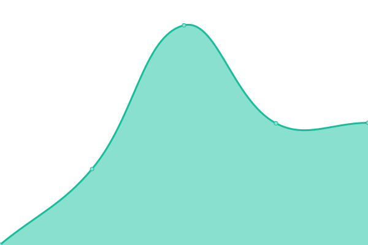
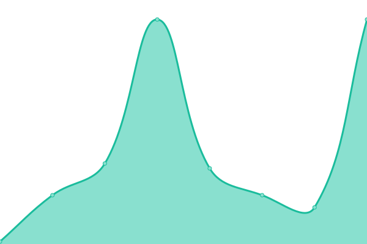

# [📈 Live Status](https://demo.upptime.js.org): <!--live status--> **🟧 Partial outage**

This repository contains the open-source uptime monitor and status page for [A-Lang](https://www.linkedin.com/in/alanghsu/), powered by [Upptime](https://github.com/upptime/upptime).

With [Upptime](https://upptime.js.org), you can get your own unlimited and free uptime monitor and status page, powered entirely by a GitHub repository. We use [Issues](https://github.com/a-lang/raida-uptime/issues) as incident reports, [Actions](https://github.com/a-lang/raida-uptime/actions) as uptime monitors, and [Pages](https://demo.upptime.js.org) for the status page.

<!--start: status pages-->
<!-- This summary is generated by Upptime (https://github.com/upptime/upptime) -->
<!-- Do not edit this manually, your changes will be overwritten -->
<!-- prettier-ignore -->
| URL | Status | History | Response Time | Uptime |
| --- | ------ | ------- | ------------- | ------ |
|  [RAIDA#0](https://raida0.cloudcoin.global/service/echo) | 🟩 Up | [raida-0.yml](https://github.com/a-lang/raida-uptime/commits/master/history/raida-0.yml) | 

 496ms
     
 | 

<a href="https://a-lang.github.io/raida-uptime/history/raida-0">100.00%</a>
    

|  [RAIDA#1](https://raida1.cloudcoin.global/service/echo) | 🟩 Up | [raida-1.yml](https://github.com/a-lang/raida-uptime/commits/master/history/raida-1.yml) | 

 476ms
     
 | 

<a href="https://a-lang.github.io/raida-uptime/history/raida-1">100.00%</a>
    

|  [RAIDA#2](https://raida2.cloudcoin.global/service/echo) | 🟩 Up | [raida-2.yml](https://github.com/a-lang/raida-uptime/commits/master/history/raida-2.yml) | 

 1901ms
     
 | 

<a href="https://a-lang.github.io/raida-uptime/history/raida-2">100.00%</a>
    

|  [RAIDA#3](https://raida3.cloudcoin.global/service/echo) | 🟩 Up | [raida-3.yml](https://github.com/a-lang/raida-uptime/commits/master/history/raida-3.yml) | 

 355ms
     
 | 

<a href="https://a-lang.github.io/raida-uptime/history/raida-3">100.00%</a>
    

|  [RAIDA#4](https://raida4.cloudcoin.global/service/echo) | 🟩 Up | [raida-4.yml](https://github.com/a-lang/raida-uptime/commits/master/history/raida-4.yml) | 

 364ms
     
 | 

<a href="https://a-lang.github.io/raida-uptime/history/raida-4">100.00%</a>
    

|  [RAIDA#5](https://raida5.cloudcoin.global/service/echo) | 🟩 Up | [raida-5.yml](https://github.com/a-lang/raida-uptime/commits/master/history/raida-5.yml) | 

 873ms
     
 | 

<a href="https://a-lang.github.io/raida-uptime/history/raida-5">100.00%</a>
    

|  [RAIDA#6](https://raida6.cloudcoin.global/service/echo) | 🟩 Up | [raida-6.yml](https://github.com/a-lang/raida-uptime/commits/master/history/raida-6.yml) | 

 322ms
     
 | 

<a href="https://a-lang.github.io/raida-uptime/history/raida-6">100.00%</a>
    

|  [RAIDA#7](https://raida7.cloudcoin.global/service/echo) | 🟩 Up | [raida-7.yml](https://github.com/a-lang/raida-uptime/commits/master/history/raida-7.yml) | 

 390ms
     
 | 

<a href="https://a-lang.github.io/raida-uptime/history/raida-7">100.00%</a>
    

|  [RAIDA#8](https://raida8.cloudcoin.global/service/echo) | 🟩 Up | [raida-8.yml](https://github.com/a-lang/raida-uptime/commits/master/history/raida-8.yml) | 

 416ms
     
 | 

<a href="https://a-lang.github.io/raida-uptime/history/raida-8">100.00%</a>
    

|  [RAIDA#9](https://raida9.cloudcoin.global/service/echo) | 🟩 Up | [raida-9.yml](https://github.com/a-lang/raida-uptime/commits/master/history/raida-9.yml) | 

 409ms
     
 | 

<a href="https://a-lang.github.io/raida-uptime/history/raida-9">100.00%</a>
    

|  [RAIDA#10](https://raida10.cloudcoin.global/service/echo) | 🟩 Up | [raida-10.yml](https://github.com/a-lang/raida-uptime/commits/master/history/raida-10.yml) | 

 325ms
     
 | 

<a href="https://a-lang.github.io/raida-uptime/history/raida-10">100.00%</a>
    

|  [RAIDA#11](https://raida11.cloudcoin.global/service/echo) | 🟩 Up | [raida-11.yml](https://github.com/a-lang/raida-uptime/commits/master/history/raida-11.yml) | 

 407ms
     
 | 

<a href="https://a-lang.github.io/raida-uptime/history/raida-11">100.00%</a>
    

|  [RAIDA#12](https://raida12.cloudcoin.global/service/echo) | 🟩 Up | [raida-12.yml](https://github.com/a-lang/raida-uptime/commits/master/history/raida-12.yml) | 

 431ms
     
 | 

<a href="https://a-lang.github.io/raida-uptime/history/raida-12">100.00%</a>
    

|  [RAIDA#13](https://raida13.cloudcoin.global/service/echo) | 🟩 Up | [raida-13.yml](https://github.com/a-lang/raida-uptime/commits/master/history/raida-13.yml) | 

 728ms
     
 | 

<a href="https://a-lang.github.io/raida-uptime/history/raida-13">100.00%</a>
    

|  [RAIDA#14](https://raida14.cloudcoin.global/service/echo) | 🟩 Up | [raida-14.yml](https://github.com/a-lang/raida-uptime/commits/master/history/raida-14.yml) | 

 256ms
     
 | 

<a href="https://a-lang.github.io/raida-uptime/history/raida-14">100.00%</a>
    

|  [RAIDA#15](https://raida15.cloudcoin.global/service/echo) | 🟩 Up | [raida-15.yml](https://github.com/a-lang/raida-uptime/commits/master/history/raida-15.yml) | 

 546ms
     
 | 

<a href="https://a-lang.github.io/raida-uptime/history/raida-15">100.00%</a>
    

|  [RAIDA#16](https://raida16.cloudcoin.global/service/echo) | 🟩 Up | [raida-16.yml](https://github.com/a-lang/raida-uptime/commits/master/history/raida-16.yml) | 

 809ms
     
 | 

<a href="https://a-lang.github.io/raida-uptime/history/raida-16">100.00%</a>
    

|  [RAIDA#17](https://raida17.cloudcoin.global/service/echo) | 🟩 Up | [raida-17.yml](https://github.com/a-lang/raida-uptime/commits/master/history/raida-17.yml) | 

 368ms
     
 | 

<a href="https://a-lang.github.io/raida-uptime/history/raida-17">100.00%</a>
    

|  [RAIDA#18](https://raida18.cloudcoin.global/service/echo) | 🟩 Up | [raida-18.yml](https://github.com/a-lang/raida-uptime/commits/master/history/raida-18.yml) | 

 349ms
     
 | 

<a href="https://a-lang.github.io/raida-uptime/history/raida-18">100.00%</a>
    

|  [RAIDA#19](https://raida19.cloudcoin.global/service/echo) | 🟩 Up | [raida-19.yml](https://github.com/a-lang/raida-uptime/commits/master/history/raida-19.yml) | 

 2823ms
     
 | 

<a href="https://a-lang.github.io/raida-uptime/history/raida-19">100.00%</a>
    

|  [RAIDA#20](https://raida20.cloudcoin.global/service/echo) | 🟩 Up | [raida-20.yml](https://github.com/a-lang/raida-uptime/commits/master/history/raida-20.yml) | 

 356ms
     
 | 

<a href="https://a-lang.github.io/raida-uptime/history/raida-20">100.00%</a>
    

|  [RAIDA#21](https://raida21.cloudcoin.global/service/echo) | 🟩 Up | [raida-21.yml](https://github.com/a-lang/raida-uptime/commits/master/history/raida-21.yml) | 

 1255ms
     
 | 

<a href="https://a-lang.github.io/raida-uptime/history/raida-21">100.00%</a>
    

|  [RAIDA#22](https://raida22.cloudcoin.global/service/echo) | 🟩 Up | [raida-22.yml](https://github.com/a-lang/raida-uptime/commits/master/history/raida-22.yml) | 

 224ms
     
 | 

<a href="https://a-lang.github.io/raida-uptime/history/raida-22">100.00%</a>
    

|  [RAIDA#23](https://raida23.cloudcoin.global/service/echo) | 🟩 Up | [raida-23.yml](https://github.com/a-lang/raida-uptime/commits/master/history/raida-23.yml) | 

 426ms
     
 | 

<a href="https://a-lang.github.io/raida-uptime/history/raida-23">100.00%</a>
    

|  RAIDA#24 Canada | 🟥 Down | [raida-24-canada.yml](https://github.com/a-lang/raida-uptime/commits/master/history/raida-24-canada.yml) | 

 0ms
     
 | 

<a href="https://a-lang.github.io/raida-uptime/history/raida-24-canada">2.51%</a>
    

|  [Test for HEAD](https://www.google.com) | 🟩 Up | [test-for-head.yml](https://github.com/a-lang/raida-uptime/commits/master/history/test-for-head.yml) | 

 32ms
     
 | 

<a href="https://a-lang.github.io/raida-uptime/history/test-for-head">100.00%</a>
    

|  Secret Site | 🟥 Down | [secret-site.yml](https://github.com/a-lang/raida-uptime/commits/master/history/secret-site.yml) | 

 0ms
     
 | 

<a href="https://a-lang.github.io/raida-uptime/history/secret-site">99.34%</a>
    

<!--end: status pages-->

[**Visit our status website →**](https://demo.upptime.js.org)

## 📄 License

- Powered by: [Upptime](https://github.com/upptime/upptime)
- Code: [MIT](./LICENSE) © [A-Lang](https://www.linkedin.com/in/alanghsu/)
- Data in the `./history` directory: [Open Database License](https://opendatacommons.org/licenses/odbl/1-0/)
