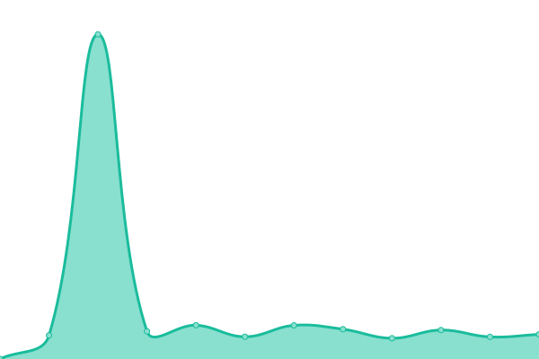

# [📈 Live Status](https://uptime.cloudcoin.tw): <!--live status--> **🟥 Complete outage**

This repository contains the open-source uptime monitor and status page for [A-Lang](https://www.linkedin.com/in/alanghsu/), powered by [Upptime](https://github.com/upptime/upptime).

With [Upptime](https://upptime.js.org), you can get your own unlimited and free uptime monitor and status page, powered entirely by a GitHub repository. We use [Issues](https://github.com/a-lang/raida-uptime/issues) as incident reports, [Actions](https://github.com/a-lang/raida-uptime/actions) as uptime monitors, and [Pages](https://demo.upptime.js.org) for the status page.

<!--start: status pages-->
<!-- This summary is generated by Upptime (https://github.com/upptime/upptime) -->
<!-- Do not edit this manually, your changes will be overwritten -->
<!-- prettier-ignore -->
| URL | Status | History | Response Time | Uptime |
| --- | ------ | ------- | ------------- | ------ |
|  RAIDA#0 Australia | 🟥 Down | [raida-0-australia.yml](https://github.com/a-lang/raida-uptime/commits/HEAD/history/raida-0-australia.yml) | 

 457ms
     
 | 

<a href="https://uptime.cloudcoin.tw/history/raida-0-australia">99.99%</a>
    

|  RAIDA#1 Macedonia | 🟥 Down | [raida-1-macedonia.yml](https://github.com/a-lang/raida-uptime/commits/HEAD/history/raida-1-macedonia.yml) | 

 292ms
     
 | 

<a href="https://uptime.cloudcoin.tw/history/raida-1-macedonia">99.99%</a>
    

|  RAIDA#2 Philippines | 🟥 Down | [raida-2-philippines.yml](https://github.com/a-lang/raida-uptime/commits/HEAD/history/raida-2-philippines.yml) | 

 365ms
     
 | 

<a href="https://uptime.cloudcoin.tw/history/raida-2-philippines">99.99%</a>
    

|  RAIDA#3 Serbia | 🟥 Down | [raida-3-serbia.yml](https://github.com/a-lang/raida-uptime/commits/HEAD/history/raida-3-serbia.yml) | 

 211ms
     
 | 

<a href="https://uptime.cloudcoin.tw/history/raida-3-serbia">99.99%</a>
    

|  RAIDA#4 Switzerland | 🟥 Down | [raida-4-switzerland.yml](https://github.com/a-lang/raida-uptime/commits/HEAD/history/raida-4-switzerland.yml) | 

 282ms
     
 | 

<a href="https://uptime.cloudcoin.tw/history/raida-4-switzerland">99.99%</a>
    

|  RAIDA#5 South Korea | 🟥 Down | [raida-5-south-korea.yml](https://github.com/a-lang/raida-uptime/commits/HEAD/history/raida-5-south-korea.yml) | 

 702ms
     
 | 

<a href="https://uptime.cloudcoin.tw/history/raida-5-south-korea">99.11%</a>
    

|  RAIDA#6 Japan | 🟥 Down | [raida-6-japan.yml](https://github.com/a-lang/raida-uptime/commits/HEAD/history/raida-6-japan.yml) | 

 303ms
     
 | 

<a href="https://uptime.cloudcoin.tw/history/raida-6-japan">99.99%</a>
    

|  RAIDA#7 UK | 🟥 Down | [raida-7-uk.yml](https://github.com/a-lang/raida-uptime/commits/HEAD/history/raida-7-uk.yml) | 

 420ms
     
 | 

<a href="https://uptime.cloudcoin.tw/history/raida-7-uk">99.99%</a>
    

|  RAIDA#8 India | 🟥 Down | [raida-8-india.yml](https://github.com/a-lang/raida-uptime/commits/HEAD/history/raida-8-india.yml) | 

 483ms
     
 | 

<a href="https://uptime.cloudcoin.tw/history/raida-8-india">99.99%</a>
    

|  RAIDA#9 India | 🟥 Down | [raida-9-india.yml](https://github.com/a-lang/raida-uptime/commits/HEAD/history/raida-9-india.yml) | 

 314ms
     
 | 

<a href="https://uptime.cloudcoin.tw/history/raida-9-india">99.99%</a>
    

|  RAIDA#10 Germany | 🟥 Down | [raida-10-germany.yml](https://github.com/a-lang/raida-uptime/commits/HEAD/history/raida-10-germany.yml) | 

 287ms
     
 | 

<a href="https://uptime.cloudcoin.tw/history/raida-10-germany">99.99%</a>
    

|  RAIDA#11 USA | 🟥 Down | [raida-11-usa.yml](https://github.com/a-lang/raida-uptime/commits/HEAD/history/raida-11-usa.yml) | 

 258ms
     
 | 

<a href="https://uptime.cloudcoin.tw/history/raida-11-usa">99.99%</a>
    

|  RAIDA#12 India | 🟥 Down | [raida-12-india.yml](https://github.com/a-lang/raida-uptime/commits/HEAD/history/raida-12-india.yml) | 

 411ms
     
 | 

<a href="https://uptime.cloudcoin.tw/history/raida-12-india">99.99%</a>
    

|  RAIDA#13 Taiwan | 🟥 Down | [raida-13-taiwan.yml](https://github.com/a-lang/raida-uptime/commits/HEAD/history/raida-13-taiwan.yml) | 

 123ms
     
 | 

<a href="https://uptime.cloudcoin.tw/history/raida-13-taiwan">99.51%</a>
    

|  RAIDA#14 Russia | 🟥 Down | [raida-14-russia.yml](https://github.com/a-lang/raida-uptime/commits/HEAD/history/raida-14-russia.yml) | 

 382ms
     
 | 

<a href="https://uptime.cloudcoin.tw/history/raida-14-russia">99.99%</a>
    

|  RAIDA#15 Russia | 🟥 Down | [raida-15-russia.yml](https://github.com/a-lang/raida-uptime/commits/HEAD/history/raida-15-russia.yml) | 

 483ms
     
 | 

<a href="https://uptime.cloudcoin.tw/history/raida-15-russia">99.27%</a>
    

|  RAIDA#16 UK | 🟥 Down | [raida-16-uk.yml](https://github.com/a-lang/raida-uptime/commits/HEAD/history/raida-16-uk.yml) | 

 451ms
     
 | 

<a href="https://uptime.cloudcoin.tw/history/raida-16-uk">99.99%</a>
    

|  RAIDA#17 Singapore | 🟥 Down | [raida-17-singapore.yml](https://github.com/a-lang/raida-uptime/commits/HEAD/history/raida-17-singapore.yml) | 

 231ms
     
 | 

<a href="https://uptime.cloudcoin.tw/history/raida-17-singapore">99.99%</a>
    

|  RAIDA#18 USA | 🟥 Down | [raida-18-usa.yml](https://github.com/a-lang/raida-uptime/commits/HEAD/history/raida-18-usa.yml) | 

 2501ms
     
 | 

<a href="https://uptime.cloudcoin.tw/history/raida-18-usa">21.07%</a>
    

|  RAIDA#19 Argentina | 🟥 Down | [raida-19-argentina.yml](https://github.com/a-lang/raida-uptime/commits/HEAD/history/raida-19-argentina.yml) | 

 498ms
     
 | 

<a href="https://uptime.cloudcoin.tw/history/raida-19-argentina">0.00%</a>
    

|  RAIDA#20 France | 🟥 Down | [raida-20-france.yml](https://github.com/a-lang/raida-uptime/commits/HEAD/history/raida-20-france.yml) | 

 2112ms
     
 | 

<a href="https://uptime.cloudcoin.tw/history/raida-20-france">99.58%</a>
    

|  RAIDA#21 India | 🟥 Down | [raida-21-india.yml](https://github.com/a-lang/raida-uptime/commits/HEAD/history/raida-21-india.yml) | 

 468ms
     
 | 

<a href="https://uptime.cloudcoin.tw/history/raida-21-india">100.00%</a>
    

|  RAIDA#22 USA | 🟥 Down | [raida-22-usa.yml](https://github.com/a-lang/raida-uptime/commits/HEAD/history/raida-22-usa.yml) | 

 210ms
     
 | 

<a href="https://uptime.cloudcoin.tw/history/raida-22-usa">100.00%</a>
    

|  RAIDA#23 Germany | 🟥 Down | [raida-23-germany.yml](https://github.com/a-lang/raida-uptime/commits/HEAD/history/raida-23-germany.yml) | 

 248ms
     
 | 

<a href="https://uptime.cloudcoin.tw/history/raida-23-germany">100.00%</a>
    

|  RAIDA#24 Canada | 🟥 Down | [raida-24-canada.yml](https://github.com/a-lang/raida-uptime/commits/HEAD/history/raida-24-canada.yml) | 

 352ms
     
 | 

<a href="https://uptime.cloudcoin.tw/history/raida-24-canada">100.00%</a>
    

|  RAIDA#13 Taiwan(CORS) | 🟥 Down | [raida-13-taiwan-cors.yml](https://github.com/a-lang/raida-uptime/commits/HEAD/history/raida-13-taiwan-cors.yml) | 

 210ms
     
 | 

<a href="https://uptime.cloudcoin.tw/history/raida-13-taiwan-cors">89.45%</a>
    

<!--end: status pages-->

[**Visit our status website →**](https://uptime.cloudcoin.tw)

## 📄 License

- Powered by: [Upptime](https://github.com/upptime/upptime)
- Code: [MIT](./LICENSE) © [A-Lang](https://www.linkedin.com/in/alanghsu/)
- Data in the `./history` directory: [Open Database License](https://opendatacommons.org/licenses/odbl/1-0/)
